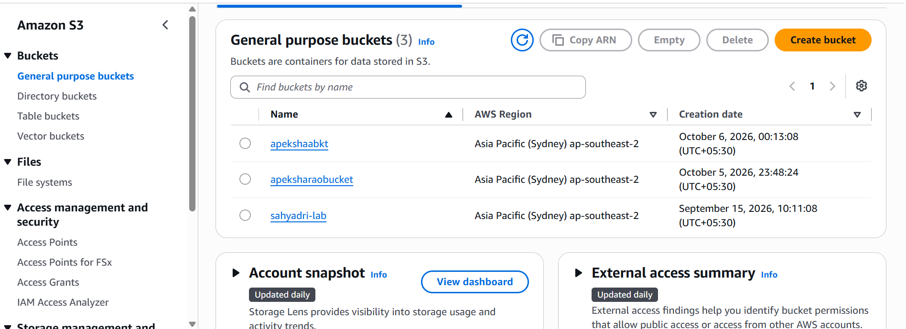
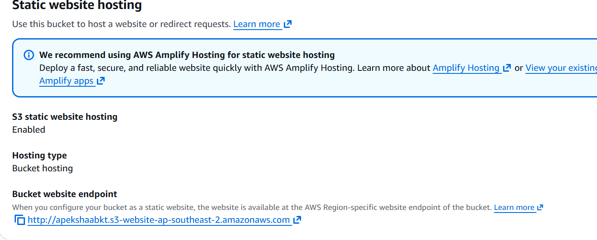
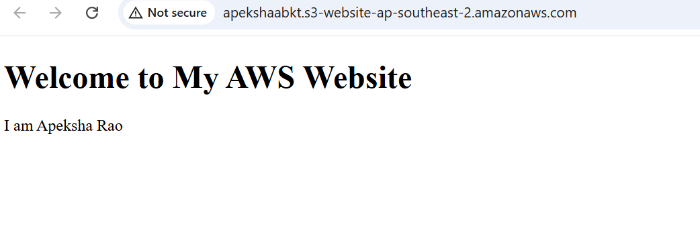

# Experiment 10: Static Website Hosting on Amazon S3

## Steps

1. Go to **AWS Console → S3 → Create bucket** and fill in:
   - Bucket name: `apekshaabkt`
   - AWS Region: same region used for the other experiments
   - Object Ownership: default
   - Block Public Access: **uncheck** `Block all public access` and confirm the warning
   - Everything else: default

   Click **Create bucket**.
2. Open the bucket, go to the **Properties** tab, scroll down to **Static website hosting** and click **Edit**:
   - Static website hosting: **Enable**
   - Hosting type: **Host a static website**
   - Index document: `index.html`

   Click **Save changes**.
3. Go to **Permissions → Bucket policy → Edit**, paste the policy below and click **Save changes**:
   ```json
   {
     "Version": "2012-10-17",
     "Statement": [
       {
         "Sid": "PublicReadGetObject",
         "Effect": "Allow",
         "Principal": "*",
         "Action": "s3:GetObject",
         "Resource": "arn:aws:s3:::apekshaabkt/*"
       }
     ]
   }
   ```
4. Create a file named `index.html` on your computer:
   ```html
   <!DOCTYPE html>
   <html>
   <head>
       <title>My AWS Static Website</title>
   </head>
   <body>
       <h1>Welcome to My AWS Website</h1>
       <p>This website is hosted using Amazon S3.</p>
       <p>Experiment 10 - Static Web Application</p>
   </body>
   </html>
   ```
5. Go to **S3 → apekshaabkt → Objects → Upload**, click **Add files**, select `index.html` and click **Upload**.
6. Go to **Properties → Static website hosting**, copy the **Bucket website endpoint** and open it in a new browser tab.

## Output


