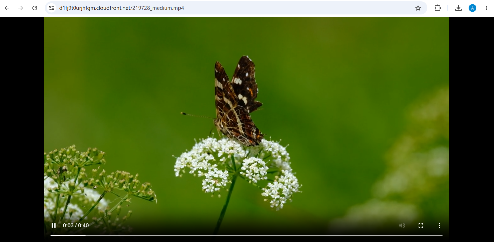
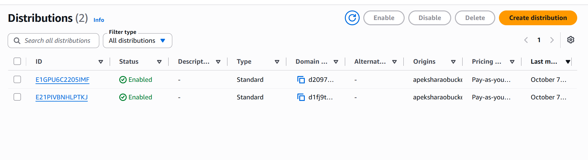

# Video Streaming using Amazon S3 and CloudFront

## Steps

### Part 1: Create the S3 bucket and upload the video

1. Open the AWS Console, go to **S3** and click **Create bucket**.
2. Enter the bucket name `apeksha-video-streaming-2026`.
3. Choose the region (Asia Pacific (Mumbai) - `ap-south-1`).
4. Keep **Object Ownership** as default.
5. Keep **Block all public access** checked.
6. Set **Bucket Versioning** to **Enable**.
7. Under **Default encryption**, select **SSE-S3**.
8. Keep the remaining settings as default and click **Create bucket**.
9. Open the bucket, click **Upload → Add files**, select the `.mp4` video and click **Upload**.

### Part 2: Create the CloudFront distribution

1. In the AWS Console, open **CloudFront → Distributions** and click **Create distribution**.
2. Under **Origin domain**, select the S3 bucket created above.
3. Under **Origin access**, select **Origin access control settings (recommended)**, click **Create control setting**, keep the defaults and click **Create**.
4. Under **Default cache behavior**, set:
   - Viewer protocol policy: **Redirect HTTP to HTTPS**
   - Allowed HTTP methods: **GET, HEAD**
   - Cache policy: **CachingOptimized**
5. Under **Web Application Firewall (WAF)**, select **Do not enable security protections**.
6. Click **Create distribution**. The status shows **Deploying** for a few minutes.

## Output

