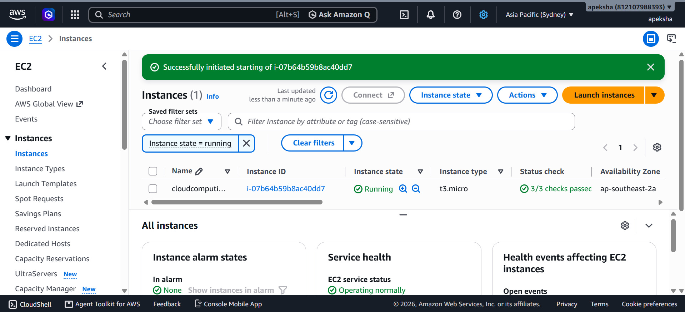

# Launching an EC2 Instance

## Steps

1. Open the AWS Console, search for **EC2**, then go to **EC2 → Instances → Launch instance**.
2. Under **Name and tags**, enter the name `MyEC2Instance`.
3. Under **Application and OS Images (AMI)**, select **Amazon Linux** (Amazon Linux 2023 AMI).
4. Under **Instance type**, select the one marked **Free tier eligible** (e.g. `t2.micro`).
5. Under **Key pair (login)**, click **Create new key pair**:
   - Key pair name: `my-ec2-key`
   - Key pair type: RSA
   - Private key file format: `.pem`

   Click **Create key pair**. The file `my-ec2-key.pem` gets downloaded.
6. Under **Network settings**, keep the defaults and make sure **SSH (port 22)** is allowed.
7. Under **Configure storage**, keep the default (8 GiB gp3).
8. Click **Launch instance**, then **View all instances**. Wait until the Instance state shows **Running**.
9. Connect using SSH from PowerShell:
   ```
   cd Downloads
   ssh -i "my-ec2-key.pem" ec2-user@<PUBLIC-IP>
   ```
   Type `yes` when asked to confirm.

## Output

