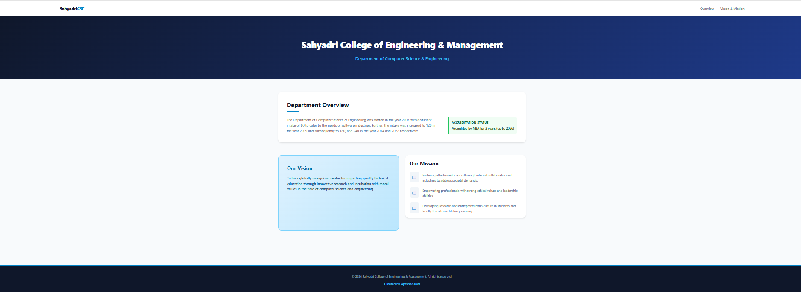

# Experiment 8: Deploy a Web Application on EC2

## Steps

1. Open the AWS Console, search for **EC2**, and click **Launch instance**.
2. Under **Name and tags**, enter `web-server`.
3. Under **Application and OS Images (AMI)**, select **Amazon Linux**.
4. Under **Instance type**, select `t3.micro`.
5. Under **Key pair**, click **Create new key pair**, name it `kyp`, keep the default options and click **Create key pair**. The file `kyp.pem` gets downloaded.
6. Under **Network settings**, tick all three:
   - Allow SSH traffic
   - Allow HTTPS traffic from the internet
   - Allow HTTP traffic from the internet
7. Keep the default storage and Advanced details.
8. Click **Launch instance**, then **View all instances**. Wait until the Instance state shows **Running**.
9. Select the `web-server` instance and click **Connect**. Choose **EC2 Instance Connect**, keep the username `ec2-user`, and click **Connect**.
10. In the terminal, switch to the root user and update the packages:
    ```
    sudo su -
    yum update -y
    ```
11. Install Apache:
    ```
    yum install -y httpd
    ```
12. Go to the web root and create the web page:
    ```
    cd /var/www/html
    nano index.html
    ```
    Paste this, then save with **Ctrl + O → Enter → Ctrl + X**:
    ```html
    <!DOCTYPE html>
    <html>
    <head>
        <title>My EC2 Web Application</title>
    </head>
    <body>
        <h1>Hello from AWS EC2!</h1>
        <p>This web page is deployed on an EC2 instance.</p>
        <p>Cloud Computing Lab</p>
    </body>
    </html>
    ```
13. Start Apache and check its status (it should show `active (running)`):
    ```
    systemctl enable httpd
    systemctl start httpd
    systemctl status httpd
    ```
14. Copy the **Public IPv4 address** of the instance and open it in a browser:
    ```
    http://<PUBLIC-IP>
    ```

## Output

