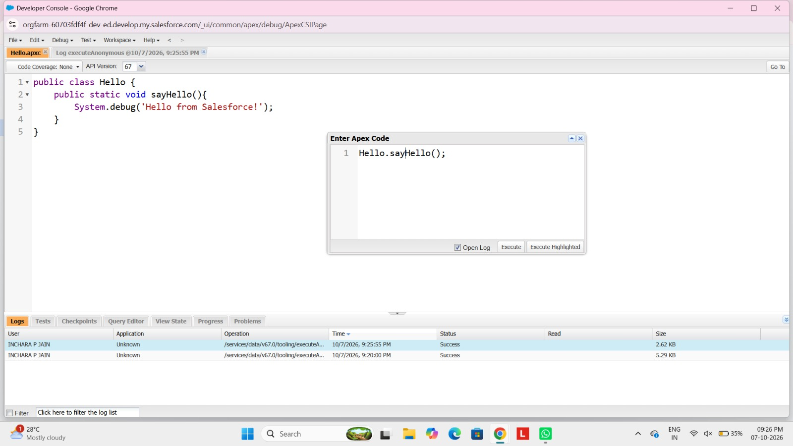
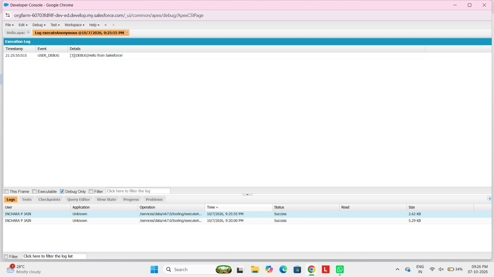

# Salesforce Experiments

## Experiment 4: Building and Running an Apex Program

### Steps
1. Sign in to your Salesforce Developer account.
2. Click the Gear icon (Setup) in the top-right corner and select Developer Console.
3. In Developer Console, go to File -> New -> Apex Class.
4. Enter the class name as HelloWorldApp and click OK.
5. Add the code:
public class HelloWorldApp {
    public static void sayHello() {
        System.debug('Welcome to Salesforce Apex');
    }
}
6. Press Ctrl + S to save the class.
7. Go to Debug -> Open Execute Anonymous Window.
8. Type the call command:
HelloWorldApp.sayHello();
9. Check the Open Log box and click Execute.
10. In the log tab, check the Debug Only box to view the output message.

## Output

