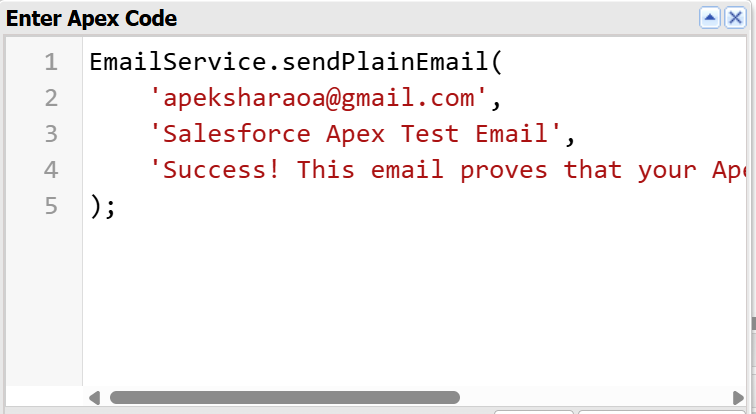
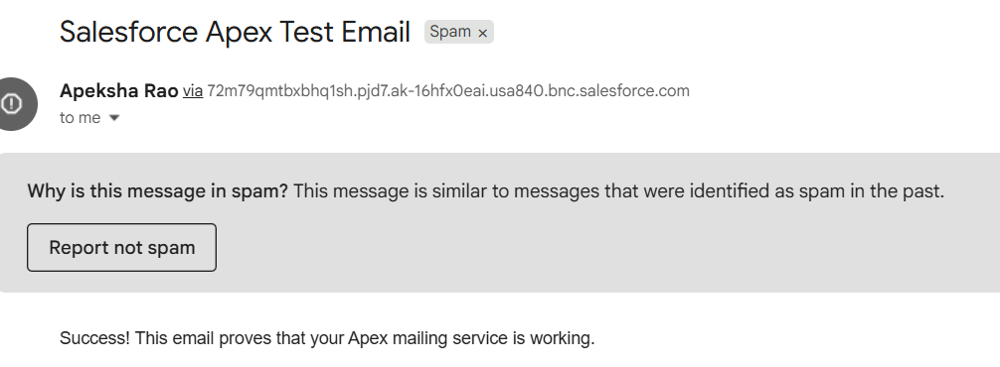
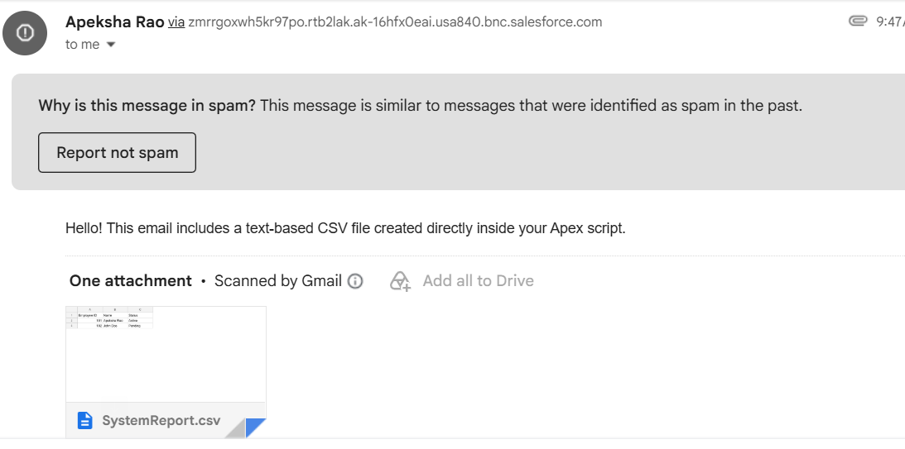

# salesforce-DC-mail-service

**Salesforce Apex Email Service — Cloud Computing Lab**

## Overview

This lab experiment demonstrates how to send emails using Apex code through the Salesforce Developer Console. The goal was to understand how Salesforce's `Messaging` class can be used to programmatically send emails and verify successful delivery.

## Objective

* Learn how to write and execute Anonymous Apex code in the Developer Console.
* Use the `Messaging.SingleEmailMessage` class to send emails.
* Send emails with different types of attachments.
* Verify successful execution using debug logs.

## Tools Used

* Salesforce Developer Console
* Apex Programming Language
* Salesforce `Messaging` API

## Basic Email Code

```
public class EmailService {

    /**
     * Sends a simple plain text email to a single recipient
     */
    public static void sendPlainEmail(String recipientAddress, String subject, String bodyText) {
        Messaging.SingleEmailMessage mail = new Messaging.SingleEmailMessage();

        mail.setToAddresses(new List<String>{ recipientAddress });
        mail.setSubject(subject);
        mail.setPlainTextBody(bodyText);

        List<Messaging.SendEmailResult> results =
            Messaging.sendEmail(
                new List<Messaging.SingleEmailMessage>{ mail }
            );

        processResults(results);
    }

    /**
     * Sends an HTML email with an optional Display Name
     */
    public static void sendHtmlEmail(
        List<String> ccAddresses,
        String subject,
        String bodyHtml,
        String displayName
    ) {
        Messaging.SingleEmailMessage mail = new Messaging.SingleEmailMessage();

        mail.setToAddresses(new List<String>{ 'primary@example.com' });

        if (ccAddresses != null && !ccAddresses.isEmpty()) {
            mail.setCcAddresses(ccAddresses);
        }

        mail.setSubject(subject);
        mail.setHtmlBody(bodyHtml);
        mail.setSenderDisplayName(displayName);

        List<Messaging.SendEmailResult> results =
            Messaging.sendEmail(
                new List<Messaging.SingleEmailMessage>{ mail }
            );

        processResults(results);
    }

    /**
     * Handles email delivery results and errors
     */
    private static void processResults(List<Messaging.SendEmailResult> results) {
        for (Messaging.SendEmailResult res : results) {
            if (res.isSuccess()) {
                System.debug('Email routing handled successfully.');
            } else {
                for (Messaging.SendEmailError error : res.getErrors()) {
                    System.debug(
                        'Email failed with message: ' + error.getMessage()
                    );
                }
            }
        }
    }
}
```

## Experiments Performed

### 1. Plain Text Email

Sent a simple text email using `Messaging.SingleEmailMessage`.

### 2. CSV File Attachment

Generated a CSV file directly using Apex code and attached it to the email using `Messaging.EmailFileAttachment`.

### 3. Image Attachment

Created an image attachment and sent it along with the email.

## Steps Followed

1. Opened the Salesforce Developer Console.
2. Went to **Debug → Open Execute Anonymous Window**.
3. Wrote and executed the Apex code.
4. Checked the execution log.
5. Verified that the email was sent successfully.
6. Checked the recipient's inbox for the received email.

## Output

### Debug Log Confirmation

The Developer Console execution log showed:

```text
USER_DEBUG | Email sent successfully!
```

### Email Received

The test email was successfully received by the recipient.

The email contained the expected subject, message body, and attachments depending on the experiment.

## Screenshots



